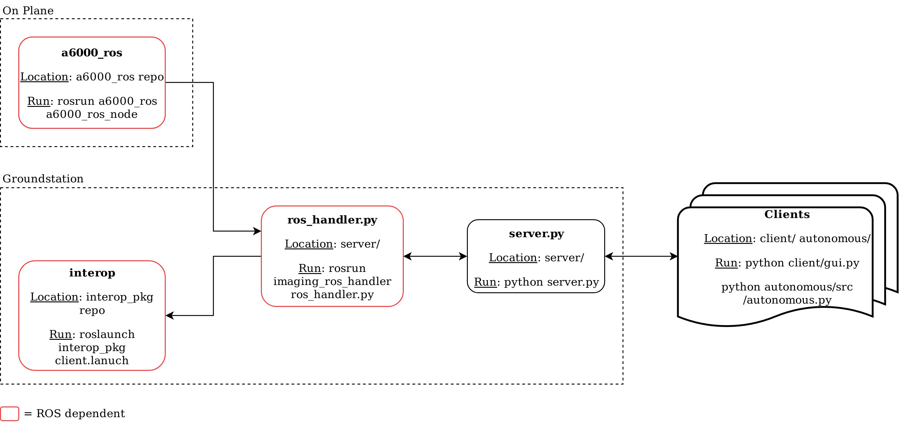

# Imaging 

This package contains (most) all the code used by the imaging subsystem.

`server/` Contains server code that is run on the ground station

`client/` Runs the manual classification client. This code is run on personal machines (and can be installed [via pip](https://pypi.org/project/byu-auvsi-imaging-client)!)

`autonomous/` Code used by the autonomous detector/classifier - generally run on a laptop or ground station

**What isn't included?**

The driver for the camera, currently the [Sony a6000](https://github.com/BYU-AUVSI/a6000_ros.git) is in its own repository. This is because it is the only piece of code that needs to be run onboard the actual plane, thus we want to make it small and easy to clone onto the planes workspace.

## Running

Here's an overview of everything that needs to be running in a competition setting.
Additional details on each of these pieces can be found in their respective locations.

## Dependencies

This package relies on a few other BYU-Auvsi packages. Changes to them could have effects here.

- [BYU-AUVSI/rosplane/rosplane_msgs/msg/State.msg](https://github.com/BYU-AUVSI/rosplane/blob/RC1.0/rosplane_msgs/msg/State.msg)

- [BYU-AUVSI/inertial_sense_ros/GPS/GPS.msg](https://github.com/BYU-AUVSI/inertial_sense_ros)

- [BYU-AUVSI/uav_msgs/srv/SubmitImage.srv](https://github.com/BYU-AUVSI/uav_msgs)

- [BYU-AUVSI/uav_msgs/msg/CompressedImageWithMeta.srv](https://github.com/BYU-AUVSI/uav_msgs)