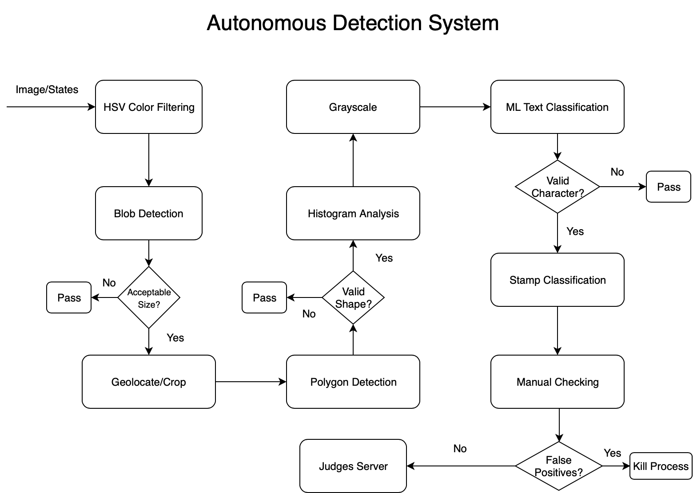
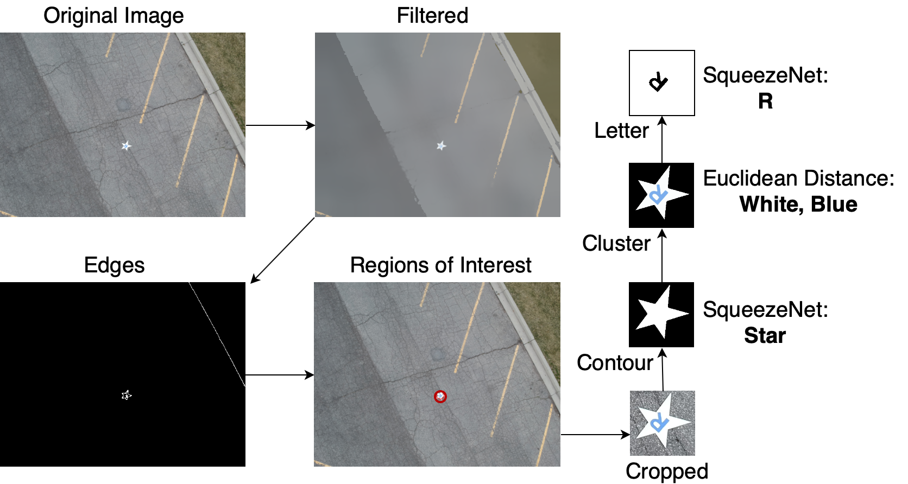

# Autonomous Classification

This is the source code for the autonomous detector/classifier client. Like manual
classification, the autonomous client does not need to be run on the server, but
must be able to connect to it. In the competition, we had it run on a single laptop.

## Structure

`util` Hold a lot of useful scripts used to help train and test the autonomous
 classifier/detector. This includes dataset generators for the letter and shape
 CNN classifiers. Pytorch scripts for training both of them, and scripts for running
 test images against the nets.

`src` Actual source code that's run for the autonomous system.

## Running it

From this folder you can run autonomous with this:

`python src/autonomous.py`

A number of command line options are provided to customize how the system is run.
You can view these options through a standard help call:

`python src/autonomous.py --help`

Of note are the `-d` and `-c` arguments which allow you to decouple the detector
and classifier and run them on separate machines. Note: everything is built in
such a way that you can run multiple autonomous clients without issue (ie: they
will not run detection or classification on the same images).

A typical command for running autonomous in a competition setting would be something like this:

`python src/autonomous.py --host 192.168.1.10 --port 5000 --show`

## Architecture

Here are some diagrams to try and help explain how the crap this all works:

You'll notice the source code is split into two major pieces: detect and classify.

Detection relies on a variety of opencv methods and works fairly well. The main
challenge with detection is finding a balance between rejecting false positives,
and recognizing actual targets. It may be worth looking into supplementing this
step with a neural net.

Classification uses a variety of methods to attempt and classify cropped targets
created by the detector. The main challenge here is getting large and _diverse_
datasets to adequately train the nets. Also, orientation classification could use
a bit of love.

## Dependencies

The autonomous system depends on a number of standard python packages
(opencv, sklearn, scipy). Slightly more complicated is its dependency on
[Pytorch](https://pytorch.org). Installation of pytorch and torchvision depends
on your machine. For instance if you're looking to train new nets, you will
definitely want to install it with CUDA (and run it on a machine with an NVidia
card). As you can imagine, installation with CUDA is different than a CPU-only
installation (which is all you need for running the classifier).
