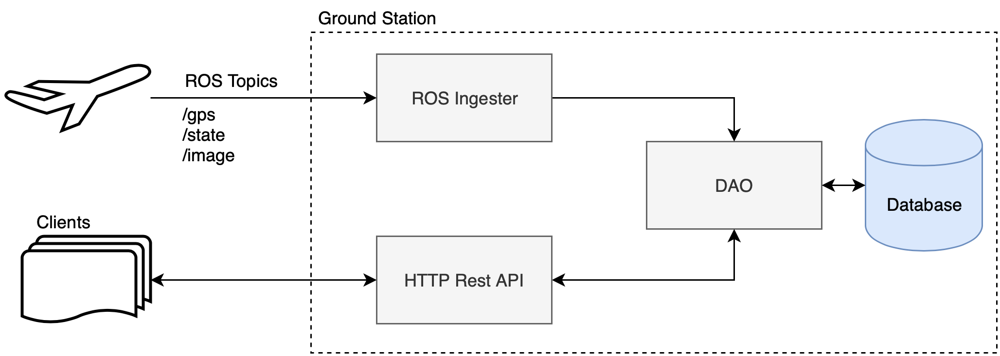
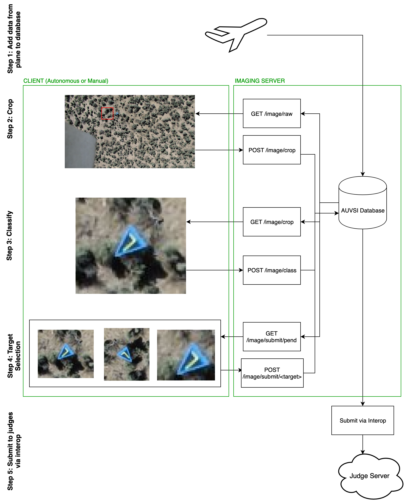

# Server

The server has 3 main jobs:

1. Ingest all new data from the ROS network into the database.
2. Service requests from the manual and autonomous classification clients. Keeping track of intermediate state and allowing multiple clients to run simultaneously.
3. Submit completed data to the interop relay/judge server

## Structure

`conf/` Holds all configurable parameters for the server. Make sure to set these up properly (the default values should work if running on your local machine)

`docs/` Documentation stuff to help describe what the heck is happening

`setup/` Contains scripts and helper files to setup the server on a fresh machine.

`src/` All source code for the server

Any folder called `internal` is stuff you dont need to worry about, unless you're really digging into things.

## Running It

Once installed (see [installation](#installation) guide below), running the rest server is easy. From this folder:

`python src/server.py`

If you also want to run the ros handler code, place this repository in your workspace/src folder. once it's built, you can run it with:

`rosrun imaging_ros_handler ros_handler.py`

(Notice that the server and ros_handler are completely independent of each other. This is intentional)

If you have a rosbag and want to load it into the database _[fast](https://youtu.be/VTHsOSGJHN0)_, use the rosbag_ingester script:

`python rosbag_ingester.py [path to bag]`

## REST API

All REST API documentation can be found on the homepage of the server, once you start it running (with `python src/server.py`). If the server is running on your machine for example, you can see the documentation at: http://localhost:5000

## Installation

There are two main installation methods: production and development.

### Development

If you're looking to develop and actively test/use the server code on your own machine, run the `./setup/dev_setup.sh` script. It's highly recommended (especially if you're using ubuntu 16.04, which has python2 by default), to use a [conda environment](https://conda.io/docs/user-guide/install/index.html).

### Production

TODO: talk about docker img

## Data Flow

Here's how the imaging data moves from the plane to the AUVSI judge server

### Step 1: Plane to ground

By streaming data over ROS, retrieve relevant imaging information (Images, state and gps data) and insert it in the server's database.

*Relevant code: ros_handler, incoming_image_dao incoming_state_dao, incoming_gps_dao*

### Step 2: Crop

Clients cycle through raw images retrieved from the server and crop relevant targets out. These cropped images are then posted to the server.

*Relevant code: raw_image_handler, crop_image_handler incoming_image_dao, cropped_image_dao*

### Step 3: Classify

This step encapsulates a few different processes. Once cropped images are created, geolocation, orientation and general target classification can take place. All three of these processes get the cropped image from the crop_image table, or the classification table. Once their process is complete they post the classification updates back to the server, which then updates the classification information for the image. State and gps information come in use here for orientation and geolocation processes.

*Relevant code: crop_image_handler, state_handler, gps_handler, image_classification_handler, cropped_image_dao, classification_dao, incoming_state_dao, incoming_gps_dao*

### Step 4: Target Selection

The server automatically bins classifications into different targets based on the classified **type, shape and alphanumeric**. Often multiple classifications will be completed for a single target. The target selection step allows the client to pick the best image and classification details for final submission to the judges.

*Relevant code: image_classification_handler, classification_dao, image_submit_handler, submitted_target_dao*

### Step 5: Judge submission via interop

Once the target is selected by the client, the final target is placed in a queue for ros_handler to send to interop over ROS. A service call is made to the interop_pkg to ensure each target is properly posted to the AUVSI judge server.

*Relevant code: submitted_target_dao, ros_handler*

## Motivation

The server/client setup minimizes imaging's dependence on ROS, thus increasing transferability. Want to use something other than ROS in the future? Then all you need to do is change the ~ 200 line ros_handler.py script, (which describes how to pull data in from the plane and publish it out to interop) and the rest (hehe) of the server-client codebase is good to go!
