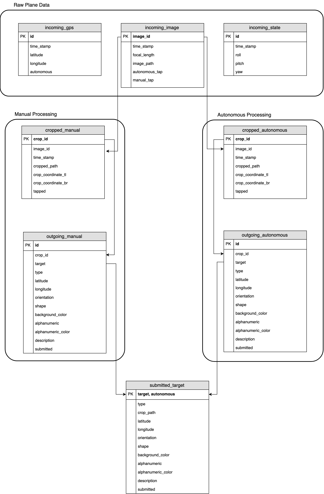

# What's happening

There are two main scripts that are run here:

`server.py` Runs the entire REST server

`ros_handler.py` Runs the ros handler, which connects ROS to the database. It subscribes to appropriate ros_topics and then pushes their messages into a database using the appropriate DAO. It also publishes final target submissions onto the network for interop.

## Other useful stuff

`test.py` Is a supplemental script used to run unit tests. Should be run when changes are made to dao modules, or from a continuous integration platform

`generate_api_tests.py` Generates the `postman_import.json` file which can be imported as a collection into [Postman](https://www.getpostman.com). The collection will have all the possible endpoints and should make it easy for you to plug in values and test them out. The root page of the server (http://localhost:5000) uses swagger which also supports some quick-and-dirty testing.

## Structure

`apis` Defines all the REST api handlers for the various components of the server. We're using [Flask-RESTPlus](https://flask-restplus.readthedocs.io) as the framework for the REST api, since it's (relatively in terms of python frameworks) lightweight and very easy to use.

`dao` Contains all the database access objects and their corresponding model classes. We could have used SqlAlchemy, but we were going for something lean, hence just the base postgres python connector (psycopg2) was used.

`test` Contains the test code run by test.py. None of this code is used in a production environment

## Database

Here's the basic database setup

Arrows represent hard relations to the corresponding (ie: an image_id in the cropped_manual will match an image_id in the incoming_image table).

Quick description of the tables:

**incoming_gps** Raw gps data from the plane. Used by the geolocation service to approximate target locations.

**incoming_image** Raw image data from the plane, Images are used by crop methods and subsequent classification methods. Focal length information associated with the image may also be used by the geolocation service.

**incoming_state** State information from the plane. Used by the geolocation service as well as classification clients to determine target orientation.

**cropped_manual** Holds target images cropped from raw images by the manual client. Also saves the coordinates of where on the raw image the crop took place, which is used by the geolocation service. There may be multiple cropped images for a single raw image.

**cropped_autonomous** Holds target images cropped from raw images by the autonomous client. Also saves the coordinates of where on the raw image the crop took place, which is used by the geolocation service. There may be multiple cropped images for a single raw image.

**outgoing_manual** Holds classification information for a manual cropped target. There may only be one classification for each cropped image. The server automatically bins classifications into 'targets'. If multiple cropped images and classifications are made of the same target, the server automatically bins them into a single target, so that only one is submitted to the judges.

**outgoing_autonomous** Holds classification information for an autonomous cropped target. There may only be one classification for each cropped image. The server automatically bins classifications into 'targets'. If multiple cropped images and classifications are made of the same target, the server automatically bins them into a single target, so that only one is submitted to the judges.

**submitted_target** Holds a target in its final form before it's submitted to the auvsi judges. When there are multiple classifications of the same target in the previous 'outgoing_' tables, manual clients can specify the classification values they want to be submitted for the final target. Otherwise (and for the autonomous client), the server will pick the most common classification values for a particular target and submit those.